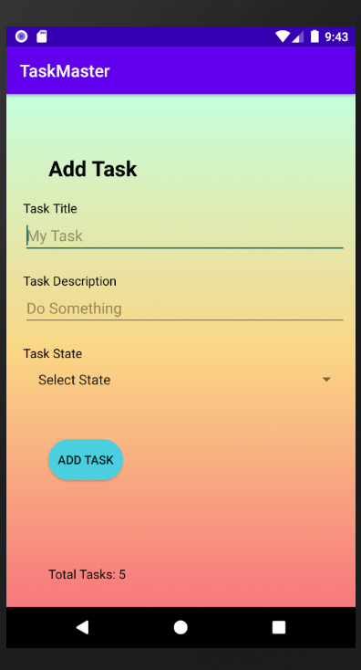
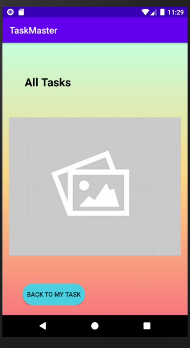
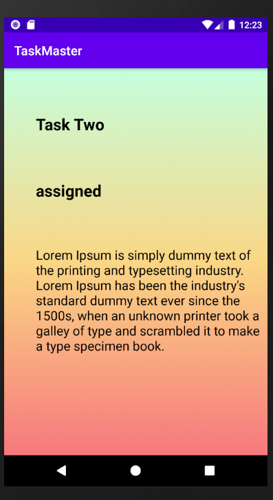
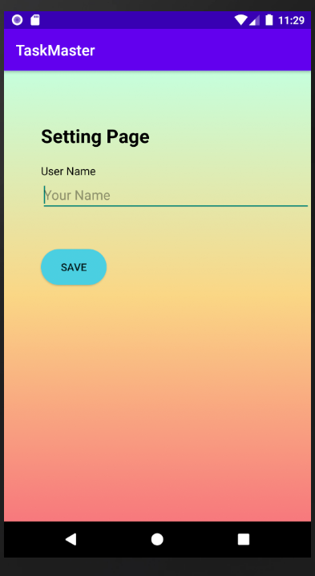

# taskmaster
- create app with this pages 
## Homepage
- The main page should be built out to match the wireframe. In particular, it should have a heading at the top of the page, an image to mock the “my tasks” view, and buttons at the bottom of the page to allow going to the “add tasks” and “all tasks” page.
- there is more three button that connect with detail page that display task information when click the button
- and there is button that connect with setting page.

- for the task that display in RecyclerView we will get it from Room (it is like local database we store task is it )
not in static way so we will deal with dynamic list of data

## Add a Task
- On the “Add a Task” page, allow users to type in details about a new task, specifically a title and a body. When users click the “submit” button, show a “submitted!” label on the page.

- here I modify to store the data the user enter and store it in database and then display it home page 

## All Tasks
- The all tasks page should just be an image with a back button; it needs no functionality.

## Task Detail Page
-  a Task Detail page. It  have a title at the top of the page, and a Lorem Ipsum description and state of task.

## Settings Page
-  a Settings page. It  allow users to enter their username and hit save.

